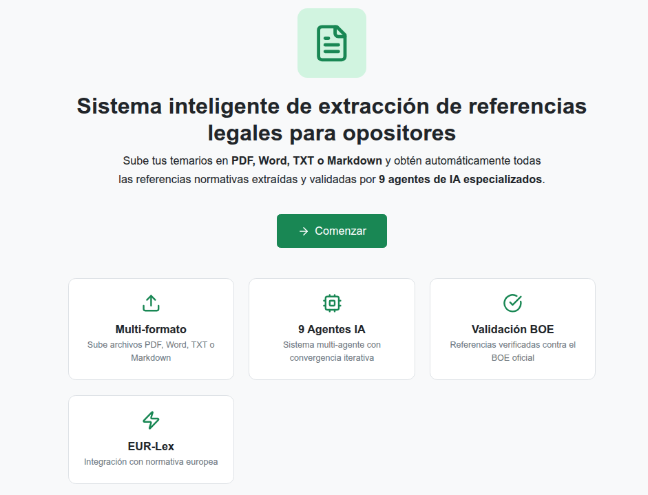
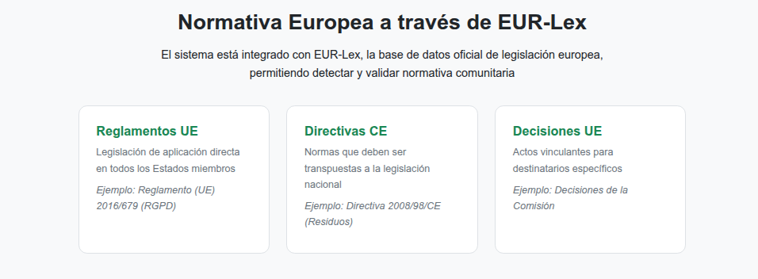
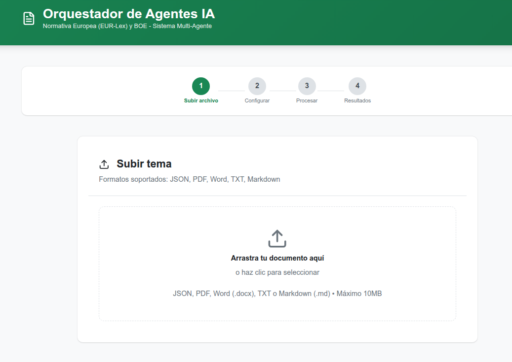
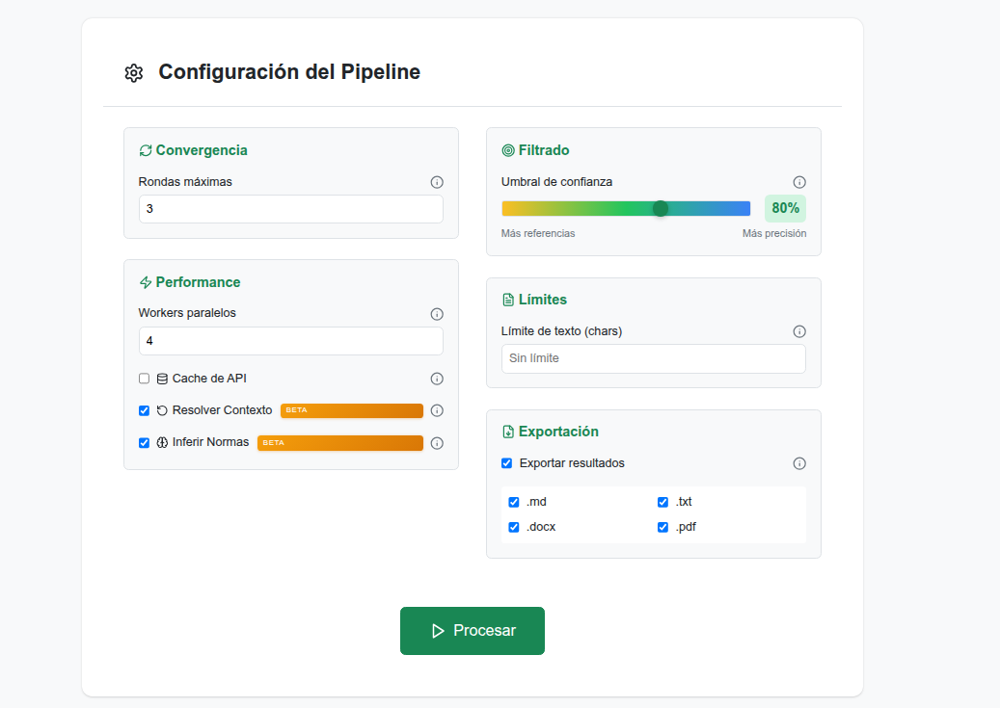
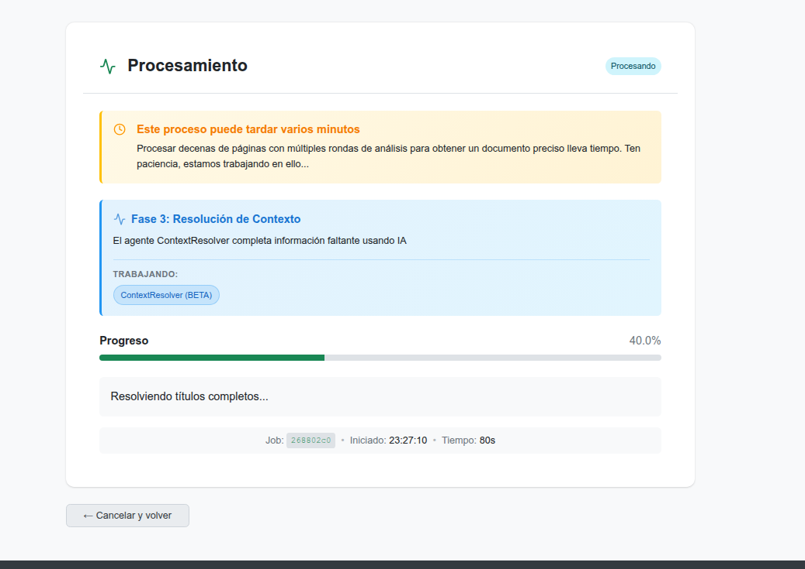
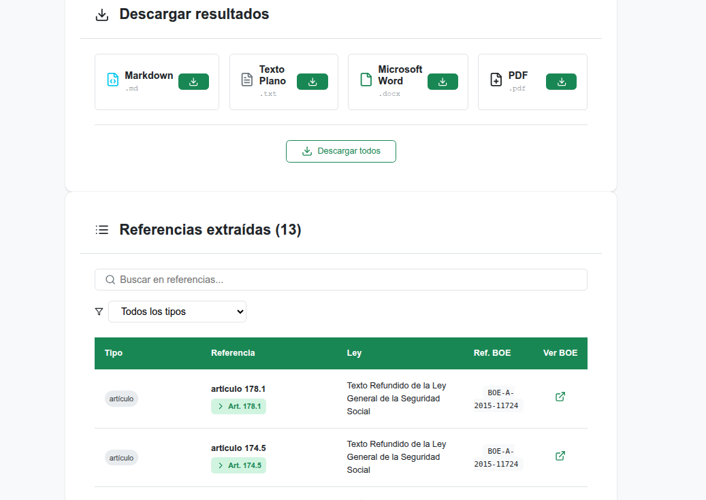
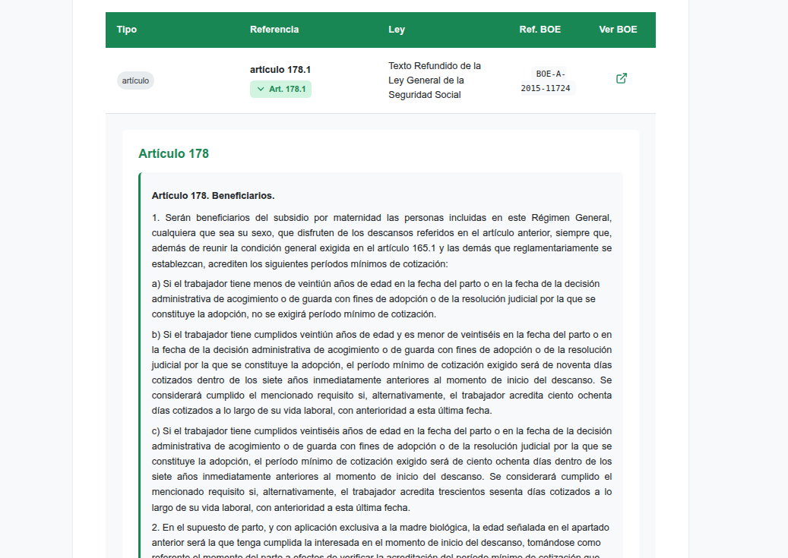
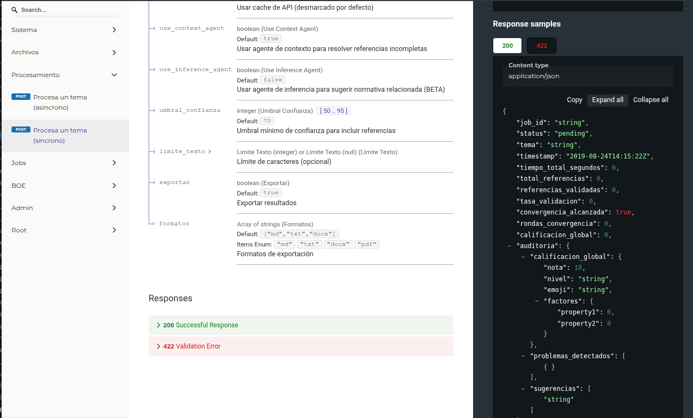
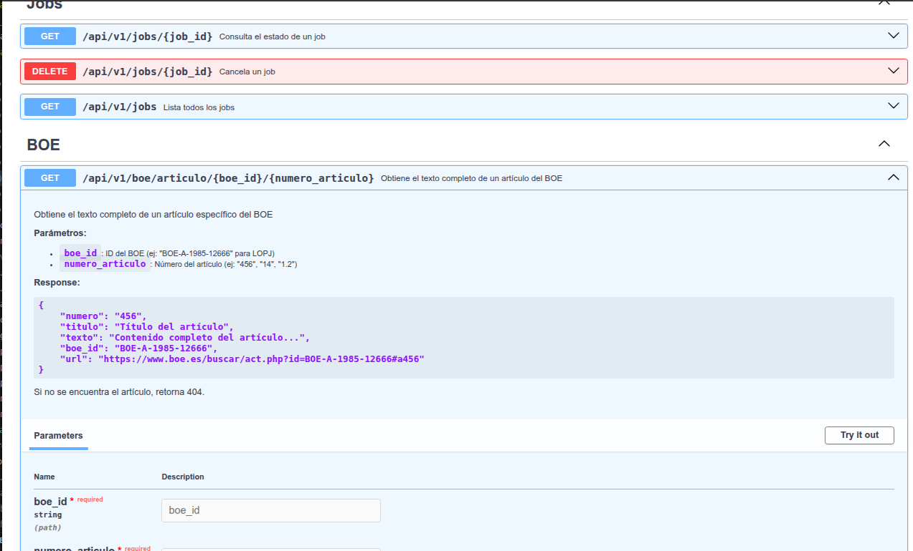

# LexAgents

[](https://github.com/686f6c61/lexagents)
[](LICENSE)
[](https://python.org)
[](https://nodejs.org)

Sistema multi-agente de extracción automática de referencias legales para opositores. Conecta con el BOE y EUR-Lex para obtener los artículos completos de cualquier tema de oposición.

**Autor:** [686f6c61](https://github.com/686f6c61)
**Repositorio:** https://github.com/686f6c61/lexagents

---

## El problema

Si estás preparando oposiciones, conoces esta situación: abres un tema y encuentras decenas de referencias legales. "Artículo 24 de la Constitución", "Ley 39/2015", "artículo 103 CE", "LOPJ", "Reglamento UE 2016/679"...

Para estudiar bien, necesitas leer esos artículos. Pero buscarlos uno a uno es un trabajo tedioso:

- Abrir el BOE o EUR-Lex
- Buscar la ley correcta
- Navegar hasta el artículo
- Copiar el texto
- Repetir decenas de veces por cada tema

Un opositor puede dedicar entre 2 y 3 horas por tema solo a esta tarea. Si tienes 60 temas, son más de 100 horas buscando artículos en lugar de estudiando.

---

## La solución

LexAgents automatiza todo ese proceso. Subes tu tema en PDF, Word o texto plano, y en unos minutos obtienes un documento con:

- Todas las referencias legales identificadas
- El texto completo de cada artículo extraído del BOE
- Enlaces directos a las fuentes oficiales
- Todo organizado y listo para estudiar

Lo que antes llevaba horas, ahora lleva minutos.

---

## Capturas de pantalla

### Pantalla de inicio


### Integracion con EUR-Lex


### Subir documento


### Configuracion del pipeline


### Procesamiento en tiempo real


### Tabla de referencias extraidas


### Detalle del articulo con texto completo del BOE


### Documentacion de la API (ReDoc)


### Documentacion de la API (Swagger)


---

## Los 8 agentes y qué hace cada uno

LexAgents funciona con un equipo de 8 agentes de inteligencia artificial. Cada agente tiene una tarea específica y están diseñados para complementarse entre sí.

### Fase 1: tres agentes buscan referencias en paralelo

Cuando subes un documento, tres agentes lo leen simultáneamente. Cada uno busca referencias legales con un enfoque diferente:

```
Tu documento ──┬──> Agente A (conservador) ──┐
               ├──> Agente B (explorador)  ──┼──> Referencias encontradas
               └──> Agente C (sabueso)     ──┘
```

**Agente A: el conservador**

Este agente solo marca una referencia si está absolutamente seguro. Busca menciones explícitas y claras como "artículo 24 de la Constitución Española" o "Ley 39/2015, de 1 de octubre". No arriesga. Si hay cualquier duda, no lo incluye.

Resultado: muy pocas referencias falsas, pero puede perderse algunas que están escritas de forma abreviada.

**Agente B: el explorador**

Busca referencias escritas de formas menos formales. Entiende siglas como "CE" (Constitución Española), "LPAC" (Ley de Procedimiento Administrativo), "LOPJ" (Ley Orgánica del Poder Judicial). También detecta formatos abreviados como "art. 24 CE" o "arts. 103 y ss. LRJSP".

Resultado: encuentra más referencias que el Agente A, aunque ocasionalmente puede incluir algún falso positivo.

**Agente C: el sabueso**

Hace una búsqueda exhaustiva. Busca cualquier mención que pueda ser una referencia legal, incluso si está escrita de forma indirecta. Detecta frases como "según establece la normativa de procedimiento" y trata de identificar a qué ley se refiere.

Resultado: máxima cobertura. Casi ninguna referencia se le escapa, aunque necesita que los agentes posteriores filtren sus resultados.

### Fase 2: cinco agentes procesan y validan

Una vez que los tres extractores terminan, sus resultados pasan por cinco agentes más que los procesan en secuencia:

```
Referencias brutas ──> Contexto ──> Títulos ──> Normalizador ──> Validador BOE ──> EUR-Lex ──> Referencias limpias
```

**Agente de contexto**

Resuelve referencias que dependen del contexto. Cuando el texto dice "el artículo anterior", "la citada ley" o "conforme al apartado 2", este agente mira hacia atrás en el documento para determinar a qué se refiere exactamente.

Ejemplo: si un párrafo habla de la Ley 39/2015 y el siguiente dice "según el artículo 53 de la misma", el agente entiende que se refiere al artículo 53 de la Ley 39/2015.

**Agente de títulos**

Traduce siglas y nombres cortos a títulos oficiales completos. Tiene un diccionario extenso de legislación española.

Ejemplos de lo que sabe:
- "CE" → "Constitución Española de 1978"
- "LPAC" → "Ley 39/2015, de 1 de octubre, del Procedimiento Administrativo Común"
- "LRJSP" → "Ley 40/2015, de 1 de octubre, de Régimen Jurídico del Sector Público"
- "LOPJ" → "Ley Orgánica 6/1985, de 1 de julio, del Poder Judicial"
- "LEC" → "Ley 1/2000, de 7 de enero, de Enjuiciamiento Civil"

**Agente normalizador**

Unifica todas las referencias a un formato estándar. Los tres extractores pueden encontrar la misma referencia escrita de formas distintas:

- "Art. 24 CE"
- "artículo 24 de la Constitución"
- "artículo veinticuatro de la Constitución Española"

El normalizador entiende que las tres son lo mismo y las agrupa en una sola entrada, eliminando duplicados.

**Agente validador BOE**

Conecta con la API oficial del Boletín Oficial del Estado para verificar cada referencia. Busca el identificador único de cada ley (formato BOE-A-XXXX-XXXXX) y confirma que el artículo existe.

Si una referencia no se puede validar en el BOE, no la descarta, pero la marca con menor nivel de confianza para que sepas que requiere revisión manual.

**Agente EUR-Lex**

Procesa las referencias a normativa europea. Cuando detecta menciones a Reglamentos, Directivas o Decisiones de la UE, genera el identificador CELEX correspondiente y conecta con el portal EUR-Lex para obtener el texto.

Ejemplos de lo que procesa:
- "Reglamento (UE) 2016/679" (RGPD)
- "Directiva 2014/23/UE" (Directiva de concesiones)
- "Decisión Marco 2002/584/JAI" (Orden europea de detención)

### Fase 3: convergencia

Después de que todos los agentes trabajen, el sistema compara los resultados. Si hay discrepancias entre lo que encontraron los extractores, ejecuta rondas adicionales hasta alcanzar consenso.

El proceso funciona así:
1. Primera ronda: los tres extractores buscan referencias
2. Se comparan resultados: ¿coinciden los tres? ¿hay contradicciones?
3. Si no hay consenso, se ejecuta otra ronda con la información anterior como contexto
4. Se repite hasta que los agentes converjan o se alcance el límite de rondas

Normalmente converge en 2-3 rondas. El máximo son 7 rondas para casos muy complejos.

### Fase 4: exportación

Finalmente, el sistema genera los documentos de salida. Por cada referencia validada, intenta obtener el texto completo del artículo desde el BOE o EUR-Lex para incluirlo en el documento final.

---

## Conexión con fuentes oficiales

LexAgents no inventa nada. Toda la información viene de fuentes oficiales:

### BOE (Boletín Oficial del Estado)

- Conexión directa con la API de datos abiertos del BOE (boe.es)
- Búsqueda por número de ley, título o identificador BOE-A
- Extracción del texto completo de cada artículo
- Caché local para no repetir consultas y respetar los límites de la API

Cuando el sistema encuentra una referencia como "artículo 103 de la Ley 39/2015", conecta con el BOE, localiza ese artículo exacto y descarga su texto íntegro.

### EUR-Lex (legislación europea)

- Generación automática de identificadores CELEX
- Conexión con el portal EUR-Lex de la Unión Europea
- Soporte para Reglamentos, Directivas y Decisiones
- Extracción de artículos de normativa europea

Para referencias como "Reglamento UE 2016/679" (el RGPD), el sistema genera el identificador CELEX correspondiente (32016R0679), conecta con EUR-Lex y obtiene el contenido.

---

## Qué obtienes al final

LexAgents genera documentos en cuatro formatos. Puedes elegir uno o varios:

**Markdown (.md)** - Formato ligero con enlaces clicables al BOE. Ideal para leer en editores de texto o convertir a otros formatos.

**Texto plano (.txt)** - El formato más simple. Una referencia por línea, fácil de imprimir o copiar a donde necesites.

**Word (.docx)** - Documento con formato profesional. Tablas organizadas, textos completos con estilo, listo para imprimir o editar.

**PDF (.pdf)** - Documento final para estudio. Formato profesional con tabla de referencias y textos completos de artículos.

Cada documento incluye:
- Lista de todas las referencias encontradas
- Tipo de cada referencia (artículo, ley, real decreto, reglamento UE, directiva...)
- Texto completo de los artículos cuando está disponible
- Nivel de confianza de cada referencia (para que sepas cuáles revisar)
- Enlaces directos a las fuentes oficiales

---

## Por qué el proceso tarda entre 3 y 5 minutos

LexAgents no es instantáneo. Hay buenas razones:

**Son 8 agentes de IA trabajando.** Cada agente hace una llamada al modelo de lenguaje. En la primera ronda, los 3 extractores trabajan en paralelo. Luego los 5 agentes de resolución trabajan en secuencia. Eso son mínimo 8 llamadas a la IA, más las rondas adicionales de convergencia.

**El proceso es iterativo.** Si los agentes no convergen en la primera ronda, el sistema ejecuta rondas adicionales. Cada ronda implica nuevas llamadas a la IA. Normalmente son 2-3 rondas, pero pueden ser hasta 7 en casos complejos.

**Conexiones con BOE y EUR-Lex.** Por cada referencia encontrada, el sistema hace consultas a las APIs oficiales para validarla y obtener el texto del artículo. Un tema con 50 referencias implica docenas de conexiones externas. El BOE tiene límites de velocidad que hay que respetar.

**El modelo razona, no solo responde.** LexAgents usa Gemini 2.5 Pro, un modelo con capacidades de razonamiento. Este modelo analiza el contexto y las posibles interpretaciones antes de responder. Eso lleva tiempo, pero produce resultados más precisos que un modelo que solo busca patrones.

**Los textos de oposiciones son densos.** Un tema típico puede tener 20-30 páginas de contenido legal complejo. Procesarlo correctamente requiere que la IA analice todo el contexto, no solo palabras sueltas.

El resultado: un proceso que tarda unos minutos, pero que te ahorra horas de trabajo manual.

---

## Por qué necesita Gemini 2.5 Pro

LexAgents requiere un modelo de IA con capacidades de razonamiento. No funciona bien con modelos más simples. Las razones:

**El contexto legal es complejo.** Las referencias no siempre son obvias. Frases como "el citado precepto", "conforme a lo dispuesto en el apartado anterior" o "según establece la normativa básica" requieren entender el contexto. Un modelo razonador analiza el documento completo y deduce a qué ley se refiere cada mención.

**Hay que deduplicar semánticamente.** "Art. 24 CE", "artículo 24 de la Constitución Española" y "artículo veinticuatro de la Constitución" son la misma referencia escrita de tres formas distintas. Un modelo razonador entiende que son equivalentes y las unifica.

**Los agentes deben colaborar.** Cuando los tres extractores producen resultados diferentes, el sistema necesita determinar cuál es correcto. Eso requiere razonamiento sobre el contexto, no simple coincidencia de patrones.

**Se necesita una ventana de contexto grande.** Gemini 2.5 Pro puede procesar documentos largos y generar hasta 65.000 tokens de salida. Un tema extenso de oposiciones necesita esa capacidad.

Modelos más simples como GPT-3.5 o modelos locales pequeños producen demasiados errores, no resuelven ambigüedades y pierden referencias importantes.

---

## Instalación y arranque

### Requisitos previos

- Python 3.13 o superior
- Node.js 18 o superior
- Una clave de API de Google Gemini (hay plan gratuito)
- Conexión a internet

### Paso 1: clonar el repositorio

```bash
git clone https://github.com/686f6c61/lexagents.git
cd lexagents
```

### Paso 2: instalar dependencias

```bash
./start.sh install
```

Este comando instala automáticamente:
- Las dependencias de Python (FastAPI, Gemini SDK, procesadores de documentos...)
- Las dependencias de Node.js (React, Vite, Axios...)

### Paso 3: configurar variables de entorno

El proyecto usa archivos `.env` para la configuracion. Hay archivos `.env.example` que sirven como plantilla.

#### Backend (`backend/.env`)

Copia el archivo de ejemplo y configura tu clave de Gemini:

```bash
cp backend/.env.example backend/.env
```

Edita `backend/.env` con tu clave:

| Variable | Requerido | Descripcion |
|----------|-----------|-------------|
| `GEMINI_API_KEY` | Si | Clave de API de Google Gemini. Obtener en: https://makersuite.google.com/app/apikey |
| `GEMINI_MODEL` | No | Modelo de Gemini a usar. Default: `gemini-2.5-pro`. Opciones: `gemini-2.5-pro`, `gemini-2.5-flash`, `gemini-2.0-flash` |
| `API_KEY` | No | Clave para proteger la API REST. Si no se configura, la API es publica (modo desarrollo) |
| `PRODUCTION` | No | Poner a `true` en produccion. Oculta detalles de errores internos |
| `RATE_LIMIT_PER_MINUTE` | No | Limite de peticiones por IP por minuto. Default: 10 |

Ejemplo minimo:
```env
GEMINI_API_KEY=tu_clave_de_gemini_aqui
```

Ejemplo para produccion:
```env
GEMINI_API_KEY=tu_clave_de_gemini_aqui
API_KEY=una_clave_segura_generada
PRODUCTION=true
RATE_LIMIT_PER_MINUTE=20
```

Para generar una API_KEY segura:
```bash
python -c "import secrets; print(secrets.token_urlsafe(32))"
```

#### Frontend (`frontend/.env`)

Copia el archivo de ejemplo:

```bash
cp frontend/.env.example frontend/.env
```

| Variable | Requerido | Descripcion |
|----------|-----------|-------------|
| `VITE_API_URL` | Si | URL del backend. Default: `http://localhost:8000` |

Para desarrollo local no necesitas cambiar nada. Solo si el backend corre en otra direccion.

### Paso 4: arrancar el sistema

```bash
./start.sh start
```

Esto inicia dos servidores:
- Backend en http://localhost:8000 (API)
- Frontend en http://localhost:3000 (interfaz web)

### Documentacion de la API

La API REST está completamente documentada. Una vez arrancado el backend:

- **http://localhost:8000/redoc** - Documentación interactiva (ReDoc)
- **http://localhost:8000/docs** - Documentación Swagger/OpenAPI

La documentación incluye todos los endpoints, parámetros, ejemplos de request/response y permite probar la API directamente desde el navegador.

### Paso 5: usar la aplicación

1. Abre http://localhost:3000 en tu navegador
2. Sube un archivo (PDF, Word, TXT o Markdown)
3. Configura las opciones si quieres (o deja los valores por defecto)
4. Pulsa "Procesar"
5. Espera a que termine (verás el progreso en tiempo real)
6. Descarga los documentos generados

### Comandos del script de gestión

```bash
./start.sh              # Abre un menú interactivo con todas las opciones
./start.sh install      # Instala todas las dependencias
./start.sh start        # Arranca backend y frontend
./start.sh stop         # Detiene todo
./start.sh restart      # Reinicia todo
./start.sh status       # Muestra si los servidores están corriendo
./start.sh logs         # Muestra los logs en tiempo real
./start.sh test         # Ejecuta los tests
./start.sh clean        # Limpia archivos temporales
./start.sh check        # Verifica que la configuración es correcta
```

### Arranque manual (alternativa)

Si prefieres arrancar los servidores por separado:

```bash
# Terminal 1: Backend
cd backend
source venv/bin/activate
python run.py

# Terminal 2: Frontend
cd frontend
npm run dev
```

---

## Estructura del proyecto

```
lexagents/
│
├── backend/                          # Servidor en Python
│   │
│   ├── agents/                       # Los 8 agentes de IA
│   │   ├── extractor_agent_a.py      # Agente A: conservador
│   │   ├── extractor_agent_b.py      # Agente B: explorador
│   │   ├── extractor_agent_c.py      # Agente C: sabueso
│   │   ├── context_resolver_agent.py # Resuelve referencias contextuales
│   │   ├── title_resolver_agent.py   # Traduce siglas a títulos completos
│   │   ├── normalizer_agent.py       # Unifica formato y elimina duplicados
│   │   ├── validator_agent.py        # Valida contra el BOE
│   │   ├── eurlex_article_extractor_agent.py  # Procesa normativa europea
│   │   ├── convergencia.py           # Coordina las rondas de convergencia
│   │   └── base_agent.py             # Clase base común
│   │
│   ├── modules/                      # Módulos de apoyo
│   │   ├── boe_searcher.py           # Busca leyes en el BOE
│   │   ├── boe_article_fetcher.py    # Descarga artículos del BOE
│   │   ├── eurlex_fetcher.py         # Conecta con EUR-Lex
│   │   ├── text_extractor.py         # Extrae texto de PDF, Word, etc.
│   │   ├── exportador.py             # Genera los documentos de salida
│   │   ├── legal_abbreviations.py    # Diccionario de siglas legales
│   │   └── auditor.py                # Audita la calidad de los resultados
│   │
│   ├── api/                          # API REST
│   │   ├── main.py                   # Aplicación FastAPI
│   │   ├── routes.py                 # Endpoints
│   │   ├── models.py                 # Modelos de datos
│   │   ├── jobs.py                   # Gestión de trabajos asíncronos
│   │   └── config.py                 # Configuración
│   │
│   ├── tests/                        # Tests automatizados
│   ├── requirements.txt              # Dependencias Python
│   └── run.py                        # Script de arranque
│
├── frontend/                         # Interfaz web en React
│   ├── src/
│   │   ├── App.jsx                   # Componente principal
│   │   ├── components/               # Componentes de la interfaz
│   │   │   ├── FileUpload.jsx        # Subida de archivos
│   │   │   ├── PipelineConfig.jsx    # Configuración del procesamiento
│   │   │   ├── ProcessingProgress.jsx # Barra de progreso
│   │   │   ├── ReferenciasTable.jsx  # Tabla de resultados
│   │   │   └── DownloadPanel.jsx     # Descarga de documentos
│   │   └── services/
│   │       └── api.js                # Cliente HTTP
│   ├── package.json
│   └── vite.config.js
│
├── data/                             # Datos de la aplicación
│   ├── uploads/                      # Archivos subidos por el usuario
│   ├── results/                      # Documentos generados
│   ├── cache/                        # Caché de consultas al BOE
│   ├── json/                         # Temas de ejemplo en formato JSON
│   └── siglas/                       # Base de datos de siglas legales
│
├── logs/                             # Registros del sistema
│   ├── api.log                       # Log del backend
│   ├── backend.log                   # Log general
│   └── frontend.log                  # Log del frontend
│
└── start.sh                          # Script de gestión
```

---

## Limitaciones

LexAgents es una herramienta potente, pero tiene límites:

**No sustituye el estudio.** Extrae y organiza referencias, pero no las explica. Sigues necesitando leer y entender los artículos.

**Depende de fuentes externas.** Si el BOE o EUR-Lex están caídos o lentos, el proceso se ralentiza o falla parcialmente.

**No es infalible.** La IA puede equivocarse. Puede perder alguna referencia oscura o interpretar mal una ambigüedad. Revisa siempre los resultados.

**Consume recursos.** Las llamadas a Gemini tienen coste (aunque el plan gratuito es generoso). Procesar muchos temas seguidos puede agotar la cuota diaria.

**Solo legislación española y europea.** No procesa normativa autonómica específica ni legislación de otros países.

---

## Licencia

Proyecto de código abierto bajo licencia MIT. Úsalo, modifícalo, mejóralo.

---

**LexAgents v0.2.0** - Diciembre 2024
Desarrollado por [686f6c61](https://github.com/686f6c61)
